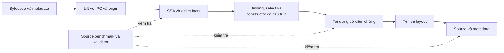

# Roadmap V2: Đưa Tovek gần source gốc

Tovek còn dư địa cải thiện đáng kể về tên biến, ranh giới biến nguồn, cấu trúc điều kiện, cây UI và các cấu trúc bị compiler tối ưu mất hình dạng. Bước tiến lớn nhất sẽ đến từ việc giữ thông tin nguồn xuyên suốt pipeline và dùng thông tin đó để chọn cách tái dựng. Các heuristic hiện tại có thể tiếp tục mở rộng, nhưng cần một bộ đo phân biệt được **đúng ngữ nghĩa**, **gần source** và **dễ đọc**. Output mặc định ưu tiên `if/else` dạng statement rõ ràng, với `return` theo nhánh khi hợp lý.

Ưu tiên đề xuất: **bộ đo và oracle → tên/nguồn gốc của binding → biểu thức và scope → đảo tối ưu hóa có kiểm chứng**. Cải thiện performance đi cùng các bước này, tập trung vào những pass đã được đo. Nhận diện thư viện và AI là nhánh bổ sung có điều kiện nghiệm thu riêng.

Các thí nghiệm trong tài liệu đã chạy trên commit `d31366187777b49430fd1164e00e7aece3df6beb`. Tiến độ và bằng chứng nghiệm thu được cập nhật tại [implementation record](roadmap_v2_implementation.md); chỉ tick phần đã triển khai và kiểm tra. Roadmap cũ được giữ tại [ROADMAP.md](ROADMAP.md); số đo, source probe và output nguyên bản của đợt nghiên cứu được lưu trong [evidence.json](roadmap_v2_research/evidence.json) và [public_matrix.json](roadmap_v2_research/public_matrix.json).

## 1. Đích đến của V2

Output tốt cần giúp người đọc nhận ra những đơn vị mà tác giả đã viết: tham số có vai trò rõ ràng, biến trung gian có chủ đích, helper có tên, vòng lặp, module, props và callback. Một hàm ngắn hơn chưa chắc gần source hơn: thay bốn biến kết quả có tên bằng một dòng `return` dài có thể làm mất ý nghĩa của thuật toán.

V2 theo thứ tự ưu tiên sau:

1. Giữ hành vi của chương trình trong phạm vi ngữ nghĩa đã công bố: giá trị và số lượng kết quả, thứ tự hiệu ứng, lỗi, alias, closure/capture và đường điều khiển.
2. Giữ thông tin còn có trong input, bao gồm tên hàm, tên debug khi có, kiểu được ghi lại và vị trí bytecode/dòng nguồn.
3. Khôi phục cấu trúc mà compiler có thể đã hạ xuống, với bằng chứng cho từng phép biến đổi; trình bày theo quy ước dễ đọc bên dưới.
4. Suy luận tên từ ngữ cảnh; phân biệt phần suy luận với dữ liệu khôi phục trực tiếp.
5. Giữ chi phí xử lý có thể đo và kiểm soát được.

### Quy ước output: ưu tiên statement rõ ràng

Ưu tiên `if/else`, phép gán trong nhánh và `return` riêng từng nhánh khi cách đó dễ theo dõi. Quy ước này áp dụng cả khi source gốc dùng `if` expression. Ví dụ output mục tiêu cho probe conditional, với tên đã được khôi phục hoặc suy luận có căn cứ:

```luau
return function(condition, primary, fallback)
    if not condition then
        primary = fallback
    end
    if primary == nil then
        return primary, "missing"
    else
        return primary, "present"
    end
end
```

Không dùng `local selected = if ... then ... else ...` hoặc conditional lồng trong `return` làm tiêu chuẩn đẹp hơn. Việc nhận diện `select` trong IR vẫn hữu ích để hiểu dataflow, đặt tên và kiểm chứng; emitter đưa nó về statement theo quy ước này. Khi cần một binding riêng vì scope, capture, evaluation order hoặc tên nguồn đã xác định, khai báo local rồi gán trong nhánh.

Gán lại parameter không tự động bị coi là xấu. Chỉ tách binding khi có bằng chứng nguồn hoặc lợi ích đọc hiểu cụ thể, đồng thời giữ hành vi. Các idiom `and`/`or` ngắn, rõ nghĩa vẫn được đánh giá theo ngữ cảnh; không ép nhánh phức tạp thành expression để giảm dòng. Phần khác biệt cú pháp do quy ước này được báo riêng trong source-fidelity metric, để có thể thấy cả độ giống source nguyên bản lẫn mức phù hợp với kiểu output đã chọn.

### Giới hạn phải ghi đúng

Bytecode có thể là kết quả của nhiều source khác nhau. Comment, tên local đã strip, alias/generic type bị xoá, cách xuống dòng và nhiều lựa chọn cú pháp không thể khôi phục duy nhất từ bytecode. Compiler Luau còn thực hiện constant folding, inlining và loop unrolling; một số quyết định của tác giả vì vậy không còn hình dạng trực tiếp trong instruction stream. [Luau performance](https://luau.org/performance/)

Do đó, “gần source gốc nhất có thể” là một mục tiêu đo trên source biết trước, kèm mức chắc chắn cho input không có source. Không nên hứa một tỷ lệ như “99% source gốc” từ số file compile được hoặc từ opcode similarity.

Phân biệt bốn loại thông tin trong metadata của kết quả:

| Loại | Ví dụ | Cách sử dụng |
|---|---|---|
| Ghi trực tiếp trong input | Debug function name, debug local có PC range | Ưu tiên giữ khi ánh xạ tới binding hợp lệ |
| Tái dựng có kiểm chứng | Gộp một vùng instruction thành call/helper với cùng dataflow và hiệu ứng | Được dùng cho output chính |
| Suy luận về source | Tên `discountRate`, một result binding riêng được suy ra từ phi | Đo độ chính xác riêng; giữ được lý do suy luận |
| Bổ sung để dễ đọc | Helper tổng hợp, tên mới, source từ upstream tương thích | Ghi rõ nguồn gốc; không tính thành phần source đã khôi phục chắc chắn |

## 2. Những gì đã kiểm tra

### 2.1. Corpus hiện tại: còn thông tin gì?

Đo ngày 2026-09-10 trên `D:/Medal/examplebytecode/RobloxProject`, dùng bản release chuẩn: `opt-level=3`, fat LTO, một codegen unit và mimalloc. Compiler đối chiếu pin tại `c2ec0d4e5ca50796ba174a7565298f59aa572268`.

| Chỉ số | Kết quả | Ý nghĩa cho V2 |
|---|---:|---|
| Input / input có bytecode | 3.978 / 3.936 | 42 file rỗng tách riêng |
| Phiên bản bytecode / type info | v9 / v3, toàn bộ input có bytecode | Đây là một phân bố cụ thể, chưa đại diện mọi compiler/version |
| Prototype gốc đọc từ input | 26.046 | Mẫu số cho các số liệu metadata dưới đây |
| Prototype có line info | 26.046 | Có cơ sở để nghiên cứu source/PC provenance trên toàn corpus |
| Prototype có function name | 9.594 | Có tín hiệu tên mạnh hơn suy đoán từ usage |
| Debug local / debug upvalue name | **0 / 0** | Đọc thêm debug locals không tự giải quyết tên cho corpus này |
| Prototype có type info | 5.695 | Có thể mở rộng phân tích vai trò/kiểu, không suy ra toàn bộ type source |
| Typed-local range / upvalue type tag | 3.045 / 394 | Kênh local đã có một phần; cần bảo toàn và phân loại độ tin cậy |
| Hash bytecode khác nhau | 3.350 | Có 586 input lặp bytecode; cần tính đến khi benchmark và chia tập |
| Output | 504.400 dòng, 13.666.349 byte LF | Mốc đo kích thước, không phải điểm fidelity |
| Token tên dạng `vN` / `pN` | 103.534 / 34.792 | Chỉ là đếm lexical, chưa phân giải binding |
| Dòng dài hơn 180 ký tự | 304 | Có một nhóm vấn đề formatter cụ thể |
| De-inline site / SETLIST fallback | 660 / 22 | Giữ làm inventory, không tối ưu số site một cách độc lập |

**Không trộn mẫu số:** 26.046 là số prototype gốc; 26.391 trong roadmap trước là số lượt structuring; 26.337 trong báo cáo oracle là tập prototype của phép so sánh. Các số này không biểu thị cùng một đại lượng.

Một kiểm tra lexical bảo thủ tìm được **457 lượt prototype có tên debug nhưng tên đó không xuất hiện như identifier ở bất kỳ đâu trong output tương ứng**. Đây là hàng đợi để audit việc mất tên, chưa phải 457 lỗi: function có thể được inline vào vị trí dùng, tên có thể trùng ở nơi khác, và cần xét binding thực tế. Có thêm 2.908 vị trí lexical dạng field nhận giá trị từ `vN`/`pN`, là ứng viên cho phân tích tên theo field flow. [Dữ liệu naming](roadmap_v2_research/evidence.json)

Luau phân biệt `-g1` — line info và function names — với `-g2` có thêm tên local/upvalue. Parser Tovek đã đọc các trường này; hiện chúng được dùng rõ nhất trong upvalue analysis, còn luồng naming chủ yếu nhận tên hàm và hint từ typed-local range. [Compiler.h được pin](https://github.com/luau-lang/luau/blob/c2ec0d4e5ca50796ba174a7565298f59aa572268/Compiler/include/Luau/Compiler.h), [parser hiện tại](../luau-lifter/src/deserializer/function.rs), [lifter](../luau-lifter/src/lifter.rs)

### 2.2. Một lỗ hổng quan trọng của phép đo hiện tại

Ba cặp source sau được compile độc lập rồi so bằng `compare_chunks` hiện hành:

| Cặp khác nhau | Quan sát khi chạy | Oracle hiện tại | `source_likeness` hiện tại |
|---|---|---|---:|
| `left - right` và `right - left` | Với `(7, 2)`: `5` và `-5` | Cả hai prototype được xếp `exact` | 1,0 |
| `return left` và `return right` | `7` và `2` | Cả hai prototype được xếp `exact` | 1,0 |
| `t.Value = left` và `t.Value = right` | Field nhận `7` và `2` | Cả hai prototype được xếp `exact` | 1,0 |

Nguyên nhân đã xác nhận trong code: normalizer bỏ quan hệ register; token similarity đổi mọi identifier không phải keyword thành `ID`. Các lớp so multiset còn chủ động bỏ một phần khác biệt về thứ tự/cấu trúc. Đây là **negative control cho bộ đo**, không phải ba output sai do decompiler tạo ra. [Implementation](../scripts/bytecode_roundtrip.py), [source và kết quả chạy](roadmap_v2_research/evidence.json)

Oracle hiện tại vẫn hữu ích để tìm drift về instruction, constant, proto và code size. Nó cần được gọi đúng là phép so sánh đã chuẩn hóa, và cần một tầng kiểm tra dataflow mạnh hơn trước các thay đổi lớn của V2.

### 2.3. Đã mở rộng đối chiếu sang source công khai

Chọn toàn bộ `.lua`/`.luau` trong production root của bốn repository, bỏ `.spec.` và `.test.`, không loại file theo kết quả:

| Bộ source | Commit đã pin | File | O0/O1/O2: compile → strict decompile → recompile |
|---|---|---:|---:|
| [Fusion](https://github.com/dphfox/Fusion/tree/2790f7b6272bdf7cd0bbfee259a2f9d79ea20810/src) | `2790f7b6` | 65 | 195/195 |
| [Roact](https://github.com/Roblox/roact/tree/1676d95c4886d51ee2b21bfcd55c6e50ece799e5/src) | `1676d95c` | 37 | 111/111 |
| [Promise](https://github.com/evaera/roblox-lua-promise/tree/031d429c82ee458a849e79fa523523bd349d7695/lib) | `031d429c` | 1 | 3/3 |
| [RbxUtil](https://github.com/Sleitnick/RbxUtil/tree/31f9120fca021e3dec275b42bc7047d626962082/modules) | `31f9120f` | 53 | 159/159 |
| **Tổng** | | **156** | **468/468** |

Có bốn source chỉ còn thân trả về nil ở O2; vẫn ghi chúng trong manifest. Đây là kiểm tra compile và đối chiếu có source, **chưa chạy các module công khai trong Roblox**, chưa phải điểm đúng ngữ nghĩa hay đánh giá holdout. Một số họ thư viện đã có trong corpus cũ nên cũng chưa độc lập với những heuristic đã phát triển. [Manifest đầy đủ, hash source và kết quả từng file](roadmap_v2_research/public_matrix.json)

Đọc đối chiếu trực tiếp cho thấy một số mục tiêu dễ quan sát:

- Roact `createElement`: ba tham số vẫn thành `p/p2/p3`, dù assertion và field flow chứa ngữ cảnh về component/props/children; function có tên trở thành anonymous return. Một message dài nhiều dòng thành literal escape trên một dòng. [Source đã pin](https://github.com/Roblox/roact/blob/1676d95c4886d51ee2b21bfcd55c6e50ece799e5/src/createElement.lua)
- RbxUtil `BufferWriter`: method shape được giữ khá tốt, nhưng một số truy cập field dùng một lần vẫn tách thành local phụ; đây là ca phù hợp để cải thiện phân tích thứ tự đánh giá và alias. [Source đã pin](https://github.com/Sleitnick/RbxUtil/blob/31f9120fca021e3dec275b42bc7047d626962082/modules/buffer-util/BufferWriter.luau)
- Fusion `springCoefficients`: giữ được phép tính và kiểu number của tham số, nhưng mất tên mang ý nghĩa toán học và biến kết quả có tên. Chỉ làm ít dòng hơn không giải quyết được độ dễ hiểu. [Source đã pin](https://github.com/dphfox/Fusion/blob/2790f7b6272bdf7cd0bbfee259a2f9d79ea20810/src/Animation/springCoefficients.luau)

### 2.4. Probe có source nhỏ: các khoảng trống tái dựng

Đã tạo bảy source probe riêng, compile tại O0/O1/O2 và `-g1/-g2`: **42/42 output parse được**. Chạy source và output bằng Luau CLI cho cùng test vector cho kết quả **42/42 trùng quan sát**: scalar, nil/false, NaN/infinity, closure result, UI call trace, thứ tự `__mul` của loop và loại lỗi được bắt bằng `pcall`. Không so stack location hay mọi input có thể có. Source, output O2 và log kiểm tra đều nằm trong [evidence.json](roadmap_v2_research/evidence.json).

**Tên debug còn nguyên nhưng chưa xuất hiện trong output.** Source `invoiceTotal` có các tham số `unitPrice`, `quantity`, `discountRate` và local `subtotal`, `discountAmount`, `totalCost`. Bản `-g2` chứa đầy đủ bảy tên kể cả tên hàm; output vẫn có dạng:

```luau
return function(p: number, p2: number, p3: number)
    local v = p * p2
    local v2 = v * p3
    local v3 = v - v2
    return v3, function()
        return v2, v3
    end
end
```

Đây là cơ hội khôi phục trực tiếp cho input có debug info. Với corpus strip local hiện tại, vẫn có cơ hội giữ function name từ `-g1` và suy luận các tên còn thiếu bằng cách khác.

**Helper có tên và loop bị unroll vẫn chưa về hình dạng nguồn.** Probe chứa helper `adjust(value, bias)`, hai lần gọi helper, rồi một loop bốn lượt. Compiler text xác nhận hai lần inlining và một lần unroll. Một phần output O2 hiện tại:

```luau
local v = p < 0 and 3 or p * 2 + 3
local v2 = p + 1
local v3 = v2 < 0 and 3 or v2 * 2 + 3
local v4 = 0 + p * 1 + p * 2 + p * 3 + p * 4
return v + v3 + v4
```

Source có thể nhận ra tốt hơn bằng hai call `adjust(...)` và loop ban đầu. `expr_deinline` hiện có ngưỡng readability dựa trên anchor, loại các helper số học không có global/string anchor. Mở rộng cần thay đổi tiêu chí chọn candidate cùng với kiểm chứng, không chỉ hạ ngưỡng toàn cục. [Expression de-inliner](../ast/src/expr_deinline.rs)

**Select trong source được trình bày thành statement.** Source probe:

```luau
return function(condition, primary, fallback)
    local selected = if condition then primary else fallback
    return selected, if selected == nil then "missing" else "present"
end
```

Output O2:

```luau
return function(p, p2, p3)
    if not p then
        p2 = p3
    end
    if p2 == nil then
        return p2, "missing"
    else
        return p2, "present"
    end
end
```

Kiểu statement của output trên phù hợp quy ước V2; phần cần cải thiện ở output này là tên và thông tin binding. Bên trong pipeline, nên giữ hoặc nhận lại phi/select trước coalescing để phân tích nguồn gốc giá trị, naming và capture. Việc đó không yêu cầu in lại `if` expression hay tạo thêm `selected` khi không có lợi ích rõ ràng. Pass conditional hiện tìm temporary được gán ở hai nhánh rồi dùng một lần ngay sau đó; quyết định emit expression của pass cần được tách khỏi phân tích. [Conditional reconstruction](../ast/src/conditional_expressions.rs), [SSA destruction](../cfg/src/ssa/destruct.rs)

**Table có nhánh còn cơ hội tổ chức rõ hơn.** Probe `branch_ui` khởi tạo props, chọn `BackgroundTransparency` ở hai nhánh, rồi gán children và gọi factory. Output vẫn là chuỗi tạo bảng → `if` → field write → call. Hướng cải thiện là tên props có nghĩa, nhóm field ổn định và child tree đọc được, đồng thời giữ phần chọn giá trị ở `if/else` tường minh. Có thể precompute một giá trị rồi đưa vào constructor khi chứng minh được thứ tự; không bắt buộc mọi field phải nằm trong một literal. Các ca có capture hoặc quan sát bảng đang khởi tạo vẫn cần giữ thứ tự hiện tại.

### 2.5. Performance đã đo

Máy đo: Windows, Intel Core Ultra 9 275HX, 24 core/24 logical processor. Mỗi cấu hình có ba lượt sau một lượt warm-up; thứ tự thread count được xen kẽ. Đo process wall time cho toàn bộ đọc/decode/decompile/ghi output, dùng warm cache và thư mục output được tái sử dụng.

| Thread | Trung vị | Min–max |
|---:|---:|---:|
| 1 | 22,696 s | 22,555–22,759 s |
| 4 | 5,000 s | 4,890–5,359 s |
| 8 | 2,823 s | 2,593–2,831 s |
| 16 | 1,747 s | 1,739–1,937 s |

Một run riêng có instrumentation `MEDAL_PROF`, một thread, chỉ ra các vùng đáng kiểm tra:

| Counter | Thời gian ghi nhận | Cách đọc |
|---|---:|---|
| `S_DEINLINE` | 5,923 s | Bao gồm de-inline và common-tail factoring bên trong fixed point |
| `F_SSA_INLINE` | 2,613 s | Nhóm SSA inlining |
| `F_SSA_CONSTRUCT` | 2,582 s | Xây dựng SSA |
| `F_RESTRUCTURE` | 1,609 s | Structurer có proof |
| `S_REBUILD_TABLES` | 1,170 s | Nhóm dựng lại table/UI |
| `S_NAME_LOCALS` | 1,095 s | Đặt tên |
| `F_DESTRUCT` | 1,034 s | Ra khỏi SSA |
| `S_FORMAT` | 0,272 s | Formatter hiện tại |

Các counter không bao phủ mọi công việc; `PAR_LOOP_WALL` còn bao các `F_*`. Run instrumented mất 41,277 s và có overhead đáng kể, nên **không dùng thời gian đó làm throughput baseline hoặc cộng các counter lồng nhau**. Bảng trên định hướng profiling sâu, chưa chứng minh một hàm cụ thể gây ra toàn bộ chi phí.

Năm ca đơn lẻ cũng khác nhau: `Write` trung vị 0,142 s, vùng restructure nổi bật; `LightningCore` 0,189 s, nhóm de-inline nổi bật; `HyperText` 0,084 s; `Menu` 0,028 s; `Promise` 0,066 s. Đây là process latency sau warm-up với một thread, không phải p95 của toàn corpus. Chưa đo peak RSS, allocation census và cold-cache latency trong đợt này. [Run và profile từng ca](roadmap_v2_research/evidence.json)

## 3. Bộ tiêu chí nghiệm thu V2

Giữ các gate cũ trong giai đoạn chuyển tiếp. Bổ sung các trục dưới đây và báo cáo riêng; không gộp thành một phần trăm làm che regression.

| Trục | Cách đo cần có | Điều kiện chấp nhận |
|---|---|---|
| Ngữ nghĩa | Runtime differential, mutant controls, dataflow/CFG/arity/capture validation | Không có sai khác chưa giải thích; validator phải phân biệt proved/unknown/different |
| Tên binding | Match binding nguồn–output bằng AST/provenance; exact spelling và đánh giá vai trò là hai chỉ số | Tên debug được giữ tại mapping đã chứng minh; precision và coverage của tên suy luận cùng được báo cáo |
| Cấu trúc nguồn | AST sau khi bỏ trivia/type-only syntax, giữ liên kết identifier; CFG và call graph; ghi riêng khác biệt do style statement | Báo raw fidelity cùng mức phù hợp style, có cải thiện trên tập giữ riêng; không lấy ít `if`/ít dòng làm kết luận |
| Khôi phục tối ưu hóa | Precision/recall của call-site và loop so với source/compiler witness | Không tính helper tổng hợp vào helper gốc; không thưởng de-inline sai nguồn chỉ vì rút gọn |
| Dễ đọc | Tên có nghĩa, alias phụ, độ phức tạp biểu thức, độ lồng control-flow, style statement và review trước/sau | Không phạt việc gán lại parameter chỉ vì có phép gán; không đánh đồng độ lồng UI với control-flow thừa |
| Formatter | Parse, giá trị literal/constant, layout snapshots chọn lọc | Không đổi byte của string hay arity để đạt line width |
| Performance | Warm/cold, in-memory/CLI, median/p95/max, RSS và allocations | So cùng input/build/máy/options; xác nhận output không đổi cho tối ưu thuần performance |
| Ổn định | Lặp run, thay thread count, incremental/cache | Output và metadata cần ổn định theo hợp đồng tương ứng |

Mốc định lượng cho các thuật toán mới phải được khóa **trước khi tối ưu trên tập đánh giá**. Đợt này chưa có binding-aware name accuracy hay AST fidelity score, nên chưa đặt một con số “tăng X% gần source” thiếu baseline.

Chia tập theo repository/họ thư viện và source lineage, khử duplicate trước khi chia. Những module cùng source nằm ở ba đường dẫn khác nhau không tạo thành ba mẫu độc lập. 156 module công khai trong đợt này là tập khảo sát ban đầu; cần thêm họ source được giữ riêng cho nghiệm thu.

## 4. Thiết kế nền cần hướng tới

Giữ pipeline đang hoạt động và bổ sung provenance theo từng bước. Tovek đã có block PC range, identity của local, typed-local hint, capture proof và source map cho closure. V2 mở rộng các kênh này tới statement/value/binding thay vì xây lại toàn bộ từ đầu. [CFG metadata](../cfg/src/function.rs), [local identity](../ast/src/local.rs), [closure source map](../ast/src/formatter.rs)



Một giá trị SSA, một register VM và một biến mà tác giả đã viết là ba khái niệm khác nhau. Phải giữ được quan hệ giữa chúng để biết khi nào nên inline temporary, khi nào nên giữ một binding có ý nghĩa, và khi nào hai giá trị không được gộp chỉ vì sống ở các thời điểm khác nhau.

`Select` là một node phân tích giá trị được chọn từ các nhánh, không phải cam kết về cú pháp output. Tầng emit dùng quy ước statement ở §1; phép hạ node phải giữ evaluation order, scope và số lượng kết quả. Biểu diễn phân tích và cách trình bày được kiểm tra bằng những gate riêng.

Line info là tín hiệu cho việc chọn cấu trúc, không phải proof độc lập: một dòng source có thể sinh nhiều instruction, nhiều biểu thức có thể ở cùng dòng, và inlining đưa dòng của callee vào caller. Runtime equivalence vẫn cần kiểm chứng bằng dataflow, control flow, arity và hiệu ứng.

## 5. Các hạng mục triển khai

### Bảng ưu tiên

“Tác động” là đánh giá dựa trên các ca đã quan sát; “quy mô” là tương đối, không phải cam kết thời gian hay mức tăng điểm.

| Mục | Kết quả chính | Ưu tiên | Quy mô | Phụ thuộc |
|---|---|---|---|---|
| R0 | Đo đúng fidelity và phát hiện sai dataflow | Bắt buộc | Vừa → lớn | Không |
| R1 | Giữ function/debug names có thật | Rất cao | Nhỏ → vừa | Gate và probe của R0 |
| R2 | Giữ provenance và binding nguồn | Rất cao | Lớn | R0 |
| R3 | Đặt tên theo quan hệ dữ liệu và module | Rất cao | Lớn | R1, R2 |
| R4 | Khôi phục select, scope và constructor | Rất cao | Lớn | R0, R2 |
| R5 | Đảo inlining/specialization/unrolling | Cao | Lớn, có phần R&D | R0, R2, R4 |
| R6 | Giữ ý nghĩa và cải thiện layout | Cao, có phần làm sớm | Nhỏ → vừa | R0; phần binding cần R1/R2 |
| R7 | Giảm chi phí pass, allocation và xử lý lặp | Cao | Vừa → lớn | Baseline performance của R0 |
| R8 | Source thư viện có fingerprint phù hợp | Bổ sung | Vừa | Validator và manifest |
| R9 | AI naming và tìm candidate nâng cao | Thử nghiệm | R&D | R0, R2, R3, R5 |

### R0. Xây bộ đo nguồn và tầng kiểm tra dataflow

**Vấn đề:** oracle đang bỏ register identity, còn token similarity không đo tên. Nếu giữ nguyên hai thước đo này, có thể tối ưu một thứ không tương ứng với mục tiêu của V2.

**Công việc:**

- [x] Đưa ba negative control đã chứng minh vào test của oracle; thêm positive control cho renumber register, reorder constant pool có sửa reference và thay metadata thuần túy. — 12 unit tests và 9 compiler controls qua; xem implementation record.
- [x] Làm rõ tên/status của `exact` hiện tại: đó là equality sau normalization. Giữ raw delta và gate cũ để triage trong giai đoạn chuyển tiếp. — Report thêm tầng `dataflow` độc lập, không đổi baseline/gate cũ.
- [x] Thêm biểu diễn so sánh giữ thứ tự operand và use–def: parameter/upvalue là input phân biệt; register tạm được alpha-rename; phi, call target, argument/result arity và capture mode vẫn có nghĩa.
- [x] Giữ CFG successor/condition, thứ tự effect và vòng đời closure trong tầng kiểm tra. Bắt đầu với vùng không loop rồi mở rộng theo từng loại proof; trả `unknown` khi chưa chứng minh được. — Đã có ordered acyclic tree và chứng nhận CFG/register bisimulation cho v9, gồm loop/capture/CLOSE/FASTCALL; mismatch vẫn unknown. [Phạm vi và bằng chứng](dataflow_graph.md).
- [x] Thêm mutant cho đổi nhánh, trả nhầm binding, store nhầm value, call nhầm function, cắt multret, đảo effect, đổi copy/ref capture, mất CLOSE và sai iterator edge.
- [x] Dùng Luau parser để tạo AST có binding identity cho source và output. Tách type-only syntax/trivia khỏi structural score; vẫn đo tên/type source ở trục riêng. Báo cả khoảng cách với source nguyên bản và mức tuân thủ style statement; chỉ loại khác biệt style khỏi metric bổ sung khi có quy tắc normalization rõ ràng.
- [x] Đóng gói 156 source công khai thành manifest có commit/license/hash; thêm họ source giữ riêng để đánh giá. Khử duplicate/lineage trước khi chia tập.
- [x] Đưa bảy probe của đợt này vào bộ fixture có runner và expected observations; bổ sung generated programs có seed và reducer cho ca fail.
- [x] Báo cáo theo từng file và nhóm: buffer/math, UI, promise/event, OOP, loop/capture, module và type-heavy source. Tính cả trường hợp fail hoặc validator trả unknown trong mẫu số phù hợp.

**Vị trí:** [bytecode_roundtrip.py](../scripts/bytecode_roundtrip.py), [semantic_roundtrip.py](../scripts/semantic_roundtrip.py), [oracle tests](../scripts/test_bytecode_roundtrip.py), [.github/workflows/ci.yaml](../.github/workflows/ci.yaml). Tầng AST/binding comparison là công cụ mới.

**Nghiệm thu:** ba cặp sai ngữ nghĩa ở §2.2 không còn được tầng mới chấp nhận là equivalent; positive controls vẫn qua; không dùng `unknown` như một bằng chứng đúng. Có báo cáo binding-aware/structural baseline có thể chạy lại. Mỗi phép rewrite mạnh tiếp theo phải có test trước/sau và negative controls tương ứng.

**Biên nghiên cứu:** bounded translation validation là hướng tham khảo hữu ích, nhưng cần mô hình ngữ nghĩa Luau riêng. Alive2 kiểm tra LLVM và cũng có giới hạn do bounded reasoning; không thể dùng trực tiếp để “chứng minh toàn bộ decompiler”. [Alive2, PLDI 2021](https://web.ist.utl.pt/nuno.lopes/pubs.php?id=alive2-pldi21)

### R1. Giữ tên hàm và debug binding còn trong input

**Vấn đề:** dữ liệu đã được parse nhưng chưa được bảo toàn tới cách trình bày cuối. Probe `invoiceTotal` mất cả tên function và toàn bộ tên binding dù `-g2` còn dữ liệu.

**Công việc:**

- [x] Audit 457 lượt mất identifier của debug function name; phân loại anonymous-return, callback dùng một lần, prototype không được emit, rename/collision và các ca còn lại.
- [x] Giữ function identity cùng compiler-recorded name tới formatter. Khi phù hợp, giữ `local function name(...)` rồi dùng `name`, kể cả chỉ có một lần dùng.
- [x] Map debug local bằng `(prototype, register, PC interval)` sang definition/binding; không map chỉ bằng số register hoặc spelling.
- [x] Ánh xạ parameter và debug upvalue names theo slot, đồng thời xử lý alias/capture group và shadowing bằng identity.
- [x] Tách tên gốc khỏi tên suy luận. Một pass về sau không được vô tình đổi tên gốc thành một hint có điểm cao hơn.
- [x] Thêm fixture cùng register được dùng lại cho hai source local, hai local cùng tên ở scope khác nhau, closure capture và parameter bị ghi lại.

**Vị trí:** [deserializer/function.rs](../luau-lifter/src/deserializer/function.rs), [lifter.rs](../luau-lifter/src/lifter.rs), [ssa/construct.rs](../cfg/src/ssa/construct.rs), [local.rs](../ast/src/local.rs), [name_locals.rs](../ast/src/name_locals.rs), [formatter.rs](../ast/src/formatter.rs).

**Nghiệm thu:** `invoiceTotal -g2` giữ được mapping của bảy tên; các fixture debug binding không gộp sai scope/cell. Mọi trường hợp chưa map được có lý do và vẫn được tính là chưa khôi phục. Danh sách 457 được audit theo binding, không chỉ chạy một regex khác để làm số giảm.

**Tác động dự kiến:** trực tiếp cho input `-g2`; phần giữ function name có ích cho corpus `-g1` hiện tại. Không đặt kỳ vọng khôi phục debug locals từ corpus vốn không chứa chúng.

### R2. Bảo toàn provenance và biến nguồn trước khi coalescing

**Vấn đề:** sau khi SSA/destructor gộp một result vào parameter hoặc một local tái sử dụng, AST cuối có thể không còn dữ liệu để biết tác giả đã viết một biến riêng.

**Công việc:**

- [x] Nền tảng chẩn đoán: trace tùy chọn từ instruction cluster của statement tới definition SSA và ancestry của binding sau local map/coalescing; giới hạn record/ancestry, báo unknown và kiểm tra determinism. Phạm vi và phần chưa bao phủ được ghi tại [binding provenance](binding_provenance.md).
- [ ] Gắn origin ở độ hạt statement/value: prototype, PC range hoặc PC set, vai trò instruction và line range khi có. Origin sinh từ nhiều nơi phải được biểu diễn là nhiều nơi. — Đã có statement cluster/SSA write slot; arbitrary nested value còn mở.
- [ ] Giữ quan hệ definition SSA ↔ register interval ↔ source/debug binding qua inline, clone, phi elimination và local map.
- [ ] Tạo phân loại local có bằng chứng: parameter, source local đã biết, result của select, iteration binding, capture cell, compiler temporary và synthesized local.
- [ ] Tách quyết định tái sử dụng storage khỏi quyết định dùng cùng một tên/khai báo nguồn. Áp lực local của Luau vẫn là ràng buộc, nhưng không phải tiêu chí duy nhất.
- [ ] Bảo toàn source binding mạnh trước các phép inline/coalescing; với input strip, dùng role/liveness/effect facts để đề xuất split và kiểm chứng từng ca. Không tự tách một parameter đang được gán rõ ràng chỉ để tăng số local hoặc ép một initializer.
- [x] Ghi vị trí identifier cuối cùng theo binding ID, nối tới ancestry SSA/statement PC set và vị trí annotation; kiểm tra bằng parser độc lập. Interpolation có vùng opaque rõ ràng, storage ID dùng cho nhiều khai báo được đếm riêng. [Phạm vi và nghiệm thu](emission_map.md).
- [ ] Mở rộng source map hiện có từ closure occurrence tới vùng output/PC khi mapping có nghĩa; ghi rõ vùng inlined, cloned hoặc synthesized.
- [ ] Quy định mỗi pass phải giữ, hợp nhất hay vô hiệu hóa loại provenance/proof nào. Không chuyển một close/ownership certificate sang local mới chỉ vì tên giống nhau.

**Vị trí:** [cfg/function.rs](../cfg/src/function.rs), [ssa/construct.rs](../cfg/src/ssa/construct.rs), [ssa/destruct.rs](../cfg/src/ssa/destruct.rs), [ssa/close_provenance.rs](../cfg/src/ssa/close_provenance.rs), [coalesce_locals.rs](../ast/src/coalesce_locals.rs), [luau-lifter/lib.rs](../luau-lifter/src/lib.rs).

**Nghiệm thu:** trace được quan hệ `selected`–phi–parameter qua probe conditional; output dùng statement theo §1 và không bắt buộc thêm binding khi không cần. Giữ phân biệt source local với temporary trên các fixture debug; invariant capture/close và output determinism vẫn qua. Có báo cáo coverage của provenance, bao gồm các vùng chưa ánh xạ được.

**Cách triển khai:** thêm kênh metadata quanh IR đang có, đưa một nhóm transform sang dùng trước, đo rồi mở rộng. Một lần thay toàn bộ AST/SSA sẽ làm khó xác định nguồn regression.

### R3. Naming theo ràng buộc dữ liệu, kiểu và module

**Vấn đề:** một tập rule chỉ nhìn usage gần chỗ khai báo khó đặt tên đồng bộ cho nhiều parameter/local có liên hệ. Những field, message, callee và caller khác nhau có thể đưa ra hint xung đột.

**Công việc:**

- [x] Dùng các heuristic hiện có làm bộ tạo candidate; bổ sung lý do và độ tin cậy, thay vì chỉ giữ một string/score đã chọn. — Lưu proposal/priority theo binding ID, rule site và invalidation; priority là thứ tự evidence, không phải xác suất. Có giới hạn và kiểm tra không đổi output. [Hợp đồng và bằng chứng](naming_evidence.md).
- [x] Lan truyền role qua copy/phi đã chứng minh, field read/write, table record, result tuple và call argument của function resolve được. — Phạm vi bounded: immutable copies, private assignment diamond đồng thuận, fixed tuple của helper và đúng vị trí đối số; không dùng làm effect/alias proof. [Hợp đồng và nghiệm thu](graph_naming.md).
- [x] Xử lý các ca đã quan sát: table field `component = p`, `props = v`; assertion chứa tên tham số; result nhận từ cùng một helper; tên callback theo event/caller.
- [x] Kết hợp type evidence với role: buffer/offset/size, state/scope/props, result/index/item. Type tag `number` đơn độc không đủ để đặt tên `damage`, `duration` hay `price`.
- [x] Chọn tên nhất quán trong scope bằng một tập ràng buộc: cùng binding phải cùng tên, binding khác không bị capture nhầm, mutable alias không được coi là đồng nhất, source name mạnh được ưu tiên.
- [x] Resolve `require` có đường dẫn tĩnh và exports có hình dạng rõ ràng; xây summary call/return theo module và xử lý SCC cho dependency cycle. Dynamic require/call chưa rõ phải giữ unknown. — Tool phân tích tùy chọn dùng manifest script-path tường minh, private literal exports, fixed-arity summaries và SCC/fixed point có budget. Chưa dùng để tự đổi source hay chứng minh effect. [Hợp đồng, coverage và giới hạn](module_summaries.md).
- [x] Có thể bổ sung tên parameter/return từ API metadata có version; metadata về tên/type không được dùng như chứng minh API không có effect hoặc không thể throw.
- [x] Phân biệt kiểu source được ghi lại với kiểu được suy luận. Không phát sinh `export type`, generic alias hoặc annotation phức tạp như thể đã đọc được từ bytecode.
- [x] Chạy naming trên binding graph ổn định; bảo đảm các cleanup về sau không làm mất tên gốc hoặc tạo shadow mới.

**Vị trí:** [name_locals.rs](../ast/src/name_locals.rs), [local.rs](../ast/src/local.rs), [type_system.rs](../ast/src/type_system.rs), [lifter/type information](../luau-lifter/src/lib.rs), [upvalue_analysis.rs](../luau-lifter/src/upvalue_analysis.rs). Module/call summary và bộ chọn tên theo ràng buộc là phần mới.

**Nghiệm thu:** báo cáo exact identifier recovery theo binding trên source biết trước; báo cáo riêng precision/coverage của tên suy luận và đánh giá vai trò bởi người đọc. Các tên thay `pN/vN` phải có nguồn evidence; đổi tất cả thành `value1/value2` không được tính là cải thiện fidelity. Case Roact `createElement`, buffer, spring và UI phải có đối chiếu trước/sau cụ thể.

Đã nghiệm thu các cơ chế có giới hạn ở trên; [đánh giá vai trò bởi người đọc](role_naming_review.md) đã nhận phản hồi “Rõ hơn” cho ba ví dụ được hỏi; đây là nhận xét định tính, không phải độ chính xác trên toàn corpus. Summary project là công cụ phân tích tùy chọn, chưa tự áp dụng rename xuyên module.

**Thứ tự:** làm propagation trong một function/module trước; chỉ mở inter-module khi đã đo phần còn thiếu. Không mặc định rằng phân tích xuyên toàn project sẽ có lợi ở mọi file.

### R4. Hiểu select, scope và constructor; emit statement rõ ràng

**Vấn đề:** các biểu thức nguồn đã biến thành control flow/temporary có thể bị mất hình dạng trước khi AST cleanup nhìn thấy. Ngược lại, inline một field/call quá sớm có thể đổi thứ tự đánh giá hoặc trạng thái bảng mà callback quan sát.

**Công việc:**

- [x] Nhận select/conditional result từ phi và branch region trước out-of-SSA khi có proof. Giữ nguồn gốc result và binding đã biết để phục vụ naming/capture; emitter vẫn chọn statement theo §1. — Phạm vi hiện tại: nhận diện chẩn đoán diamond/triangle với mỗi arm tối đa một private block; lưu ancestry qua destruction trong trace tùy chọn. Chưa dùng trace này để mở rewrite hay suy luận tên mới.
- [ ] Hạ result dùng nhiều lần thành phép gán trong nhánh, hoặc local riêng được gán bằng `if/else` khi cần. Giữ `return` theo nhánh khi rõ ràng; không tạo initializer `if` expression hay nhân đôi expression có effect để loại local.
- [ ] Phân tích effect tinh hơn: pure và total, may-throw, table read/write, allocation, call, yield và access tới captured cell. Unknown vẫn là rào cản.
- [x] Chặn SSA inline đổi thứ tự qua phép đọc global chưa có proof; khóa trace, mutation, lỗi và result arity của environment `__index` ở O0/O1/O2, `-g1/-g2`. — Đây là một điều kiện bảo thủ trong phân tích thứ tự, chưa phải toàn bộ effect dependency graph.
- [x] Giữ số lần đánh giá base/key khi formatter tạo compound assignment; chỉ gộp index có base/key là local/literal. Fixture khóa nested `__index`, unary/binary metamethod và lỗi ở lần đọc thứ hai, kể cả khi có type hint. [Bằng chứng và phạm vi](formatter_effects.md).
- [ ] Gắn effect dependency theo vị trí đánh giá callee, argument, LHS base/key, RHS và store. Quyết định inline phải dựa trên quan hệ này.
- [ ] Dựng một vùng constructor cho bảng còn private, có chuỗi field write hoặc nhánh chọn giá trị. Emit nhóm field ổn định và children rõ ràng, giữ conditional property ở statement; chỉ precompute giá trị ngoài constructor khi giữ được thứ tự. Thử `branch_ui` trước rồi phân loại từng fallback còn lại.
- [ ] Khôi phục cây curried UI/callback theo các rule cấu trúc và ownership đã có; thư viện như Fusion/Roact cung cấp ngữ cảnh, không tự tạo ngoại lệ về semantics.
- [ ] Loại alias dùng một lần trong những ca field/call đã chứng minh giữ thứ tự, như một số method của `BufferWriter`; giữ alias khi nó chụp một giá trị trước mutation.
- [ ] Dùng facts từ runtime guard khi cần chứng minh thuộc tính giá trị. Annotation/hint kiểu không tự chứng minh tính total hay không có NaN.

**Vị trí:** [conditional_expressions.rs](../ast/src/conditional_expressions.rs), [ssa/inline.rs](../cfg/src/ssa/inline.rs), [inline_temps.rs](../ast/src/inline_temps.rs), [rebuild_table_literals.rs](../ast/src/rebuild_table_literals.rs), [side_effects.rs](../ast/src/side_effects.rs), [set_list.rs](../ast/src/set_list.rs).

**Nghiệm thu:** probe conditional emit `if/else` và `return` theo nhánh, bao gồm primary là `false` hoặc `nil`, với tên có căn cứ. `branch_ui` có tên/nhóm props và child tree rõ hơn khi đủ proof; field có điều kiện vẫn dùng statement. Ca callback quan sát partial initialization giữ nguyên thứ tự. Bộ test phải bao trùm key nil/NaN, numeric-key overlap, nil overwrite, multret, LHS evaluation, metamethod, skipped branch, mutation và capture.

**Giới hạn:** mục tiêu không phải xoá bằng được cả 22 SETLIST fallback. Một fallback còn lại có thể là biểu diễn cần thiết khi không thể chứng minh phép gộp; phải báo rõ lý do thay vì đánh đổi semantics lấy một constructor đẹp.

### R5. Đảo tối ưu hóa theo compiler, trước khi mất hình dạng

**Vấn đề:** hai vùng có cùng nguồn có thể thành AST khác nhau vì specialization, guard/return form, phi coalescing và thứ tự cleanup. Pattern matching quá muộn chỉ thấy hình dạng đã bị biến đổi nhiều lần.

**Công việc:**

- [ ] Tạo bộ ví dụ compiler cho các họ: statement/expression inlining, constant argument specialization, result alias, early return, fixed-count loop unroll và table lowering. Pin compiler/flags của từng họ.
- [ ] Giữ candidate helper gắn với prototype/capture identity; dùng line/PC provenance để tìm vùng nghi ngờ trước khi mở search trên mọi subtree.
- [ ] Chuẩn hóa candidate ở dạng dataflow/region phù hợp, với phi/select và return arity còn rõ. Không yêu cầu helper và call-site đã đi qua cùng một chuỗi AST cleanup mới nhận ra được nhau.
- [x] Mở de-inline cho helper số học có tên và specialization như `adjust`, với tiêu chí dựa trên bằng chứng/cost thay cho điều kiện phải có đủ global/string anchor. Phạm vi đã nghiệm thu: prototype có tên, return/selection scalar, đối số local ổn định hoặc literal, khớp chính xác phép toán; hai call `adjust` được khôi phục ở O2/g1 và O2/g2. [Điều kiện, budget và giới hạn](arithmetic_deinline.md).
- [ ] Giữ argument evaluation count/order và capture binding khi phục hồi call. Một argument được dùng nhiều lần hoặc chỉ dùng trong một nhánh không được tự động chuyển thành eager evaluation.
- [ ] Nghiên cứu re-roll loop có số lượt cố định, index thay đổi đều và body tương ứng. Giữ thứ tự operator/effect, giá trị induction, result/capture và ngữ nghĩa zero/last iteration.
- [x] Thử nghiệm re-roll tổng số học có giới hạn 4–8 lượt, seed `+0`, index 1..N và thứ tự operator chính xác; bảo vệ helper có tên, debug binding và capture. Chỉ bật qua `--synthesize-arithmetic-loops`, ghi rõ synthesis vì cùng mẫu có thể đến từ source không có loop. [Hợp đồng và negative control](arithmetic_reroll.md).
- [ ] Với ca không còn helper prototype hoặc có nhiều source candidate cùng hợp lệ, phân loại là suy luận/synthesis; không cộng vào số helper gốc đã khôi phục chắc chắn.
- [ ] Thử recompile candidate trong đúng context/compiler profile như một kiểm chứng bổ sung. Không dùng oracle bỏ register hiện tại làm chứng nhận cho candidate.
- [ ] Đặt budget cho số candidate, node, thời gian và bộ nhớ; có đường quay về output đã kiểm chứng khi hết budget hoặc proof không đủ.

**Vị trí:** [deinline.rs](../ast/src/deinline.rs), [expr_deinline.rs](../ast/src/expr_deinline.rs), [factor_common_tails.rs](../ast/src/factor_common_tails.rs), [region.rs](../restructure/src/region.rs), [pipeline](../luau-lifter/src/lib.rs). Cần một lớp candidate/dataflow dùng provenance; không thay toàn bộ structurer đang có proof.

**Nghiệm thu:** hai call của `helper_loop` được khôi phục đúng và có đối chiếu với source/compiler witness; loop bốn lượt được nhận đúng trong nhóm eligible đã định nghĩa. Ca `unrolled_effects` giữ nguyên trace `__mul`. Negative cases phải giữ nguyên thứ tự float, signed zero/NaN, metamethod, mutation và capture. Đo precision/recall trên source giữ riêng, không dùng việc tăng từ 660 site lên một số lớn hơn làm tiêu chuẩn duy nhất.

**Tham khảo:** SAILR cho thấy lợi ích của cách đảo những biến đổi mà compiler cụ thể thực hiện và đánh giá cấu trúc so với source. Kết quả của nghiên cứu đó ở C/GCC; phần áp dụng cho Luau là định hướng thiết kế và đo lường, cần được thực nghiệm lại. [SAILR, USENIX Security 2024](https://www.usenix.org/conference/usenixsecurity24/presentation/basque)

**Điều cần tránh trong triển khai:** re-roll một chuỗi số học không đồng nghĩa được phép đổi `0 + x*1 + x*2 + ...` thành `10*x`. Phép rút gọn đại số có thể đổi rounding, lỗi và số lần gọi metamethod; đó là một yêu cầu proof khác.

### R6. Giữ ý nghĩa nguồn và cải thiện cách trình bày

**Vấn đề:** output compile được nhưng vẫn có thể làm người đọc mất tên hàm, ý nghĩa của local trung gian hoặc phải đọc literal/constructor trên dòng rất dài.

**Công việc có thể làm sớm:**

- [x] Áp dụng style statement của §1 vào cost model và pipeline cuối: ưu tiên `if/else`, assignment và branch return; không thưởng việc nén chúng thành `local x = if ...` hoặc conditional trong `return`. Kiểm tra pass conditional hiện có cùng các cleanup chạy sau nó.
- [ ] Tách việc tắt một rewrite tạo `if` expression khỏi việc hạ conditional expression đã tồn tại trong IR. Với trường hợp nằm trong call argument, return tuple hoặc loop condition, phải giữ vị trí/thứ tự đánh giá, skipped branch và multret; chưa chứng minh được thì giữ cấu trúc statement ở bước trước.
- [x] Thêm layout theo nhóm biểu thức và line width; áp dụng cho call, return tuple, table và callback. Quyết định xuống dòng không làm thay đổi AST semantics. — Mục tiêu mềm 120 cột; toàn corpus giữ AST/binding/type syntax, xem layout audit.
- [x] In literal nhiều dòng bằng long-bracket khi bảo toàn được toàn bộ byte; chọn delimiter đúng và kiểm tra leading newline, CR/LF, byte escape và delimiter nằm trong nội dung.
- [ ] Đưa annotation của de-inline/proof/synthesis ra metadata có vị trí; hỗ trợ cách hiển thị gọn trong source. Giữ khả năng truy vết provenance của từng call-site.
- [x] Giữ tên function và source/debug local có ý nghĩa theo R1/R2; dùng cost model coi việc làm mất thông tin này là một chi phí, ngay cả khi giảm số dòng. — Binding nguồn có bằng chứng được bảo vệ bằng điều kiện cứng; vùng chưa map vẫn báo unknown.
- [x] Phân biệt nguyên nhân của dòng dài: literal, expression, UI structure hay control flow. Mỗi nhóm có cách xử lý và test riêng. — Inventory phân loại cú pháp; literal byte, group/arity và control flow dùng gate riêng, không ép mọi dòng xuống dưới ngưỡng.
- [ ] Đánh giá một số rule đang ưu tiên rút gọn, như anonymous-return và rehoist chỉ dựa trên số lần lặp, dưới mục tiêu fidelity mới. Không mở rộng hoisting nếu chưa giữ được thứ tự và scope.

**Vị trí:** [formatter.rs](../ast/src/formatter.rs), [rehoist_constants.rs](../ast/src/rehoist_constants.rs), [rebalance_expressions.rs](../ast/src/rebalance_expressions.rs), [cleanup_final.rs](../ast/src/cleanup_final.rs), [name_locals.rs](../ast/src/name_locals.rs).

**Nghiệm thu:** probe conditional tuân thủ output statement ở §1; các ca nested conditional không đổi effect/arity. Case message nhiều dòng của Roact đọc được theo layout rõ ràng và recompile giữ nguyên giá trị string; không mất function/debug binding đã phục hồi; literal/arity/parse gates qua. Một gallery nhỏ cho `Write`, `springCoefficients`, `createElement` và UI phải thể hiện đúng những thay đổi được tuyên bố. Snapshot chỉ dùng cho quyết định trình bày đáng kiểm tra, không đóng băng toàn bộ output để cản cải tiến khác.

### R7. Performance: tập trung vào chi phí đã đo

**Vấn đề:** những cơ chế lớn như mimalloc, Rayon, LTO, release optimization và stable ID đã có. Cần tìm phần công việc lặp/clone/analysis có thể loại bỏ, đồng thời giữ output và proof.

**R7a — Đo đủ trước khi thay thuật toán:**

- [x] Nền tảng profiler JSON theo file/prototype/pass: context riêng cho worker, inclusive/exclusive thread-wall timing, counter deterministic, giới hạn record và báo phần chưa đo. [Hợp đồng và cách chạy](pass_profiling.md).
- [ ] Thêm report JSON theo file/prototype/pass, gồm thời gian, số iteration, số node trước/sau, số candidate/refusal và cache hit. Tách exclusive/inclusive timing. — Đã có timing, counter/census cho de-inline/factoring và counter cache của SSA inline; census của mọi pass và allocation accounting còn mở.
- [x] Tách common-tail factoring khỏi `S_DEINLINE`; đo cả lần factoring đầu, số lần fixed point và các summary được tính lại. Counter hiện tại chưa đủ để quy toàn bộ 5,923 s cho matching. — Đã đo riêng initial/fixed-point factoring, write census, target collection và match/canonicalization counts; xem implementation record.
- [ ] Thêm benchmark in-memory API, CLI I/O, cold/warm cache và nhóm file nhỏ/lớn; ghi build hash, options, CPU, thread count, phân bố và số mẫu.
- [ ] Đo allocation count/bytes và peak RSS trên ít nhất `Write`, `LightningCore`, `Promise`, một UI lớn và toàn corpus. Những nhận định allocation-bound cũ cần được kiểm chứng lại trên pipeline V2.

**R7b — Tối ưu pass và representation:**

- [x] Cache facts read/write/captured-cell/effect trong một lượt SSA inline của từng block; vô hiệu hóa theo mutation, kiểm tra lại mọi cache hit ở debug, giữ nguyên output và đo tốc độ/RSS. [Phạm vi và hợp đồng](ssa_inline_cache.md).
- [ ] Memoize summary bất biến trong một AST/CFG epoch: read/write/capture/effect, anchor và fingerprint. Vô hiệu hóa đúng khi mutation liên quan xảy ra.
- [ ] Dùng worklist cho vùng vừa thay đổi thay vì quét lại toàn function/tree sau mỗi rewrite, khi có thể chứng minh không bỏ lỡ candidate.
- [ ] Profile và giảm deep clone/canonicalization tạm trong common-tail/de-inline; giữ ownership của block/closure khi chia sẻ dữ liệu.
- [ ] Đo cấu trúc dữ liệu của SSA construct/inline/destruct: tập local, dominance/liveness, local maps và các lần phân tích lại. Chỉ cache analysis khi CFG mutation có cơ chế invalidation rõ ràng.
- [ ] Nếu allocation/locking thực sự chiếm ưu thế, thử arena/ID hoặc immutable snapshots ở phạm vi một function trước. Không tháo `Arc/Mutex` xuyên pipeline khi chưa làm rõ ownership của closure và parallel workers.
- [ ] Thử scheduling theo ước lượng độ nặng và ngưỡng parallel task cho function nhỏ; xác nhận hiệu quả trên cả single-file và folder mode.

**R7c — Cache và build optimization:**

- [ ] Cache cho xử lý lặp/incremental theo bytecode, decode key, build/version, options và toàn bộ ngữ cảnh ảnh hưởng output. Regenerate metadata theo script identity/path khi cần.
- [ ] Chỉ deduplicate giữa các đường dẫn khi đã có context key đầy đủ. Nghiên cứu đã tìm hai nhóm cùng bytecode nhưng output khác do tên module/context; cache chỉ bằng hash bytecode sẽ trả nhầm output.
- [ ] Thử PGO bằng tập train đại diện, đánh giá trên tập giữ riêng, build sang target riêng và giữ unwind recovery. Đo Windows native và deployment target khác riêng biệt.

**Vị trí:** [profiling/pipeline](../luau-lifter/src/lib.rs), [batch.rs](../luau-lifter/src/batch.rs), [decompile_core.rs](../luau-lifter/src/decompile_core.rs), [SSA](../cfg/src/ssa.rs), [deinline.rs](../ast/src/deinline.rs), [factor_common_tails.rs](../ast/src/factor_common_tails.rs), [Cargo.toml](../Cargo.toml).

**Nghiệm thu:** với tối ưu thuần performance, output corpus phải byte-identical ở các thread count và mode đã công bố; test semantics/proof vẫn qua. Benchmark trước/sau đủ mẫu và cải thiện vượt noise; các tiêu chí median/p95/RSS được khóa trước PR. Một mục tiêu thử nghiệm hợp lý là giảm ít nhất 10% median ở workload mục tiêu mà không làm p95 hoặc bộ nhớ xấu đi đáng kể, nhưng đây là **ngưỡng đánh giá đề xuất**, chưa phải mức tăng tốc đã đạt.

586 file trùng bytecode không tương đương chắc chắn tiết kiệm 14,9% thời gian: file có độ nặng khác nhau, context/cache key có thể khác, và I/O/metadata vẫn phải xử lý. PGO cũng là thí nghiệm cần đo, không phải một phần trăm tăng tốc có sẵn. [Rust PGO documentation](https://doc.rust-lang.org/rustc/profile-guided-optimization.html)

### R8. Nhận diện source thư viện một cách có bằng chứng

**Vấn đề:** nhiều module có source công khai, nhưng trùng tên/path hoặc trùng một signature đã bỏ register không đủ để kết luận cùng code.

Thí nghiệm so fingerprint toàn chunk, giữ opcode đã decode, mọi register/operand, string/constant pool và child topology, cho 17 match giữa corpus với bộ source công khai đã compile. **Sáu match chỉ là chunk trả nil**, có cả file types và license hoàn toàn khác source. Còn **11 match không tầm thường**, chủ yếu thuộc utility/animation của Fusion. Chúng là candidate source tương thích, chưa chứng minh text source gốc. [Danh sách và phương pháp](roadmap_v2_research/evidence.json)

**Công việc:**

- [x] Tạo registry source có commit, license, compiler/version/options và fingerprint; giữ source lookup tách biệt với decompiler core.
- [x] Chấp nhận source tương thích chỉ sau kiểm tra đầy đủ; loại các match entropy thấp hoặc có nhiều source không phân biệt được. Module fork có thay đổi phải tiếp tục decompile bình thường nếu không xác minh được.
- [x] Với compiler/version khác, chỉ mở so sánh linh hoạt sau khi tầng use–def/CFG/arity đủ mạnh; không dùng fuzzy text hoặc opcode multiset để thay source.
- [x] Ghi output là “matched upstream source”, cùng nguồn/commit và khác biệt đã biết; không nói comment/type alias đó đã được khôi phục từ bytecode.
- [x] Đo coverage thực trên từng họ thư viện và phần custom code còn lại trước khi đầu tư mở registry lớn.

Đã triển khai registry tùy chọn cho v9/type-info v3, 171 source ở năm profile compiler. Fingerprint giữ cả native flag/type payload; khác version bị từ chối, chưa mở so sánh linh hoạt. Kiểm tra 855 cấu hình public và 28 đối chứng đều qua; corpus private xác minh 7/3.936 file có bytecode, sáu ca return-nil cũ đều bị từ chối. Output được xuất riêng có nhãn, commit/license và recompile gate. [Phạm vi, coverage và giới hạn](source_registry.md).

**Nghiệm thu:** sáu ca return-nil không được tự chọn một source để thay; cùng bytecode nhưng source text khác được báo ambiguous. Match hợp lệ truy được license/commit và kiểm chứng; không thay nhầm một module đã sửa. Với coverage ban đầu hiện có, đây là nhánh bổ sung, chưa thay thế R1–R5.

### R9. AI naming và tìm candidate nâng cao

**Vấn đề:** tên của thuật toán hoặc domain custom thường cần hiểu ngữ cảnh rộng hơn rule cục bộ. Tuy nhiên một tên nghe hợp lý có thể khác tên gốc, và một lần viết lại code tự do có thể đổi hành vi.

**Công việc thử nghiệm:**

- [ ] Cho model đề xuất tên cho binding ID dựa trên function body, type/field/call summaries và module context. Chỉ cho phép rename binding local đã xác định; không rename field/global/string hoặc sinh thêm logic trong bước này.
- [ ] Kết hợp candidate của model với các ràng buộc và evidence của R3; giữ tên debug, tránh capture/shadow và kiểm tra AST sau rename.
- [ ] So với deterministic naming trên tập source giữ riêng; đo exact name recovery, role quality, latency, chi phí và tỷ lệ phải từ chối.
- [ ] Duy trì một pipeline chạy được hoàn toàn không cần model; metadata ghi rõ tên suy luận. Việc dùng dịch vụ ngoài và dữ liệu gửi đi cần là lựa chọn rõ ràng của người vận hành.
- [ ] Tách một thí nghiệm khác cho bounded candidate search/e-graph: chỉ dùng rewrite đã có điều kiện ngữ nghĩa, cost model theo source fidelity và budget chặt. Bắt đầu ở vùng scalar/select nhỏ.
- [ ] Chỉ đưa kết quả R&D vào mặc định sau khi có lợi ích ổn định trên holdout và không suy giảm correctness; hết budget/không chắc thì dùng kết quả đã kiểm chứng.

**Tham khảo:** DIRE là bằng chứng rằng khôi phục identifier có thể dùng cả cấu trúc và ngôn ngữ, nhưng kết quả trên decompiled C không dự báo độ chính xác cho Luau/Roblox. Equality saturation cung cấp cơ chế lưu nhiều biểu thức tương đương và chọn theo cost; các luật tương đương vẫn phải được định nghĩa đúng cho Luau, đặc biệt float và metamethod. [DIRE](https://arxiv.org/abs/1909.09029), [egg](https://arxiv.org/abs/2004.03082)

**Nghiệm thu:** có kết quả thắng baseline deterministic trên tập giữ riêng theo tiêu chí đã khóa, có ablation, và mọi rename giữ nguyên binding graph. Candidate search không được dùng association/commutation số học hoặc suy đoán purity không có proof. Không dùng độ tự tin do model tự báo làm điều kiện đủ.

## 6. Thứ tự thực hiện và cách chia PR

Khối công việc tạo bước tiến cốt lõi là **R2 + R3 + R4 + R5**: giữ biến nguồn, hiểu quan hệ giữa chúng, nhận lại biểu thức/constructor và đảo tối ưu hóa. R0 cung cấp cách kiểm tra tiến bộ; R1/R6 tạo cải thiện quan sát được sớm; R7 giữ chi phí xử lý hợp lý.

| Mốc | Phần thực hiện | Deliverable để review | Điều kiện chuyển bước |
|---|---|---|---|
| M0 — Baseline V2 | R0 negative controls, source manifest, bộ probe và benchmark | Report có source/output, binding/structural metric ban đầu; tests cho điểm mù oracle | Phân biệt được ba cặp sai ở §2.2; cách đo/holdout được khóa |
| M1 — Tên và cách trình bày | R1 function names, đường debug binding; R6 style statement, long strings/layout | Trước/sau `invoiceTotal`, callback có tên, conditional và message dài; inventory các ca chưa map | Tên/capture/effect/arity/constant-byte/parse gates qua |
| M2 — Binding và naming | R2; R3 trong function/module | Trace source→SSA→binding; các parameter/local có tên nhất quán; probe `selected` | Không mất close/capture proof; name precision/coverage và source score cải thiện ở nhóm mục tiêu |
| M3 — Conditional/UI | R4 | Select hiểu được trong IR, output `if/else` rõ ràng, props/children được tổ chức và alias được loại bằng proof | Effect/arity/false/nil/capture negative controls qua; kết quả tốt trên họ source giữ riêng |
| M4 — Compiler-aware recovery | R5 theo từng họ transform | Call-site và loop được match với compiler witness; report precision/recall | Không tăng synthesis không có bằng chứng nguồn; validator/gates và budget qua |
| M5 — Performance | R7, có thể làm độc lập từng tối ưu sau M0 | Profile trước/sau, allocation/RSS, cache invalidation và deterministic output | Thắng benchmark đã khóa, giữ quality/proof và các output cần byte-identical |
| M6 — Nhánh mở rộng | R8 hoặc R9 khi có số liệu ủng hộ | Coverage/ablation/cost trên holdout; provenance của output | Lợi ích thực vượt chi phí và rủi ro đã đo |

Nên chia PR theo một invariant hoặc một họ transform có thể giải thích rõ. Ví dụ: đưa negative controls vào oracle; giữ tên named-return function; áp dụng style statement; nối debug PC range tới binding; nhận select trước coalescing; tổ chức props/children của private table; mở arithmetic helper matching; thử re-roll fixed-count loop. Mỗi PR có một vài cặp source/output đại diện cùng test chống biến đổi nhầm.

R0 phát triển theo lớp: negative controls và fixture/report đi trước; dataflow checker bắt đầu ở vùng nhỏ rồi mở rộng theo R4/R5. R1, phần layout thuần túy của R6 và tối ưu performance byte-identical có thể bắt đầu trên các gate phù hợp ngay sau M0.

### Định nghĩa hoàn tất một hạng mục

- [ ] Có ca trước/sau trên source biết trước, nêu rõ thông tin đã khôi phục hay suy luận.
- [ ] Có điều kiện áp dụng và ca gần giống phải từ chối.
- [ ] Có kiểm tra observable behavior phù hợp; với transform mạnh, có dataflow/CFG/effect proof hoặc validator ở phạm vi đã công bố.
- [ ] Có kết quả từng file và trên tập source giữ riêng; ghi cả unknown/refusal/failure.
- [ ] Có số đo cost và determinism tương ứng với thay đổi.
- [ ] Baseline thay đổi được review từng trường hợp; không tự làm baseline mới từ mọi output vừa sinh ra.
- [ ] Tài liệu ghi cả giới hạn còn lại; không đóng mục chỉ vì regex count hoặc tổng số dòng đẹp hơn.

## 7. Những hướng nên giới hạn hoặc hạ ưu tiên

| Hướng | Kết luận từ nghiên cứu |
|---|---|
| Tiếp tục chỉ thêm rule đặt tên riêng lẻ | Có quick win, nhưng R3 cần xử lý hint xung đột, binding identity và propagation để đi xa hơn |
| Chỉ giảm số dòng hoặc số tab sâu | Không đo được ý nghĩa tên/biến; độ lồng UI có thể phản ánh đúng source |
| Mặc định chuyển `if/else` thành `local x = if ...` | Trái quy ước output V2; nhận select trong IR phục vụ phân tích, còn output ưu tiên statement rõ ràng |
| Ép mọi conditional thành `and/or` | Không giữ đúng lựa chọn khi giá trị true-arm là false/nil; cũng không luôn giống cú pháp nguồn |
| Mở gate inline/rebuild bằng giả định toàn cục | Cần phân tích effect/alias/arity theo vùng; không mặc định field/API/callback là pure |
| Tắt kiểm tra NaN hoặc proof để code gọn hơn | Không phù hợp mục tiêu giữ semantics; tối ưu số học cần điều kiện riêng |
| Sinh helper cho mọi đoạn lặp | Có thể là refactor mới thay vì helper tác giả đã viết; đo synthesis và recovered call-site riêng |
| Thêm annotation/type alias càng nhiều càng tốt | Kiểu suy luận không chứng minh tác giả đã viết annotation/alias đó |
| Áp dụng thêm LTO/mimalloc/Rayon như một tính năng mới | Đã có trong bản đo; đầu tư vào profile, công việc lặp và dữ liệu của pass |
| Cache chỉ bằng bytecode hash | Đã có counterexample output khác theo context; cần key/invalidation đầy đủ |
| Thay module bằng source có cùng tên hoặc fuzzy signature | Đã có source khác nhau cùng chunk return-nil; cần kiểm chứng và nhãn matched source |
| Cho model viết lại nguyên function rồi chỉ compile-check | Compile được không đủ; ba negative controls đã chứng minh giới hạn của cách kiểm tra này |
| Viết lại toàn bộ decompiler để có IR mới ngay lập tức | Provenance/binding/effect có thể đưa vào từng lớp, giữ được khả năng quy lỗi cho từng thay đổi |

## 8. Tái lập các kết quả chính

### Snapshot và manifest

- Tovek: `d31366187777b49430fd1164e00e7aece3df6beb`.
- Luau compiler/runner: `c2ec0d4e5ca50796ba174a7565298f59aa572268`.
- Release binary SHA-256 và từng lượt benchmark: `benchmark` trong [evidence.json](roadmap_v2_research/evidence.json).
- Các commit source công khai, production roots, tên file, SHA-256 và status từng O-level: [public_matrix.json](roadmap_v2_research/public_matrix.json).
- Source probe nguyên bản, output O2, metadata `-g2`, bytecode text, negative controls và runtime traces: [evidence.json](roadmap_v2_research/evidence.json).

### Chạy lại một probe từ artifact

Chạy tại root repository; sửa đường dẫn compiler nếu môi trường khác. Đoạn này lấy đúng source đã lưu, compile O2 với full debug info rồi decompile bằng binary hiện tại:

```powershell
@'
import json, pathlib, subprocess
e = json.loads(pathlib.Path('docs/roadmap_v2_research/evidence.json').read_text(encoding='utf-8'))
case = next(c for c in e['probe_cases'] if c['name'] == 'debug_names')
work = pathlib.Path('out/v2-probe-replay')
work.mkdir(parents=True, exist_ok=True)
source = work / 'input.luau'
source.write_text(case['source'], encoding='utf-8')
compiler = 'D:/Medal/luau-tools-src/build/luau-compile.exe'
compiled = subprocess.run([compiler, '--binary', '-O2', '-g2', '--fflags=false', str(source)], capture_output=True, check=True)
bytecode = work / 'input.luaubc'
bytecode.write_bytes(compiled.stdout)
result = subprocess.run(['target/release/luau-lifter.exe', str(bytecode), '--strict-no-synthetic-control'], capture_output=True, check=True)
(work / 'output.luau').write_bytes(result.stdout)
print(result.stdout.decode())
'@ | python -
```

Để replay một negative control, lấy hai source trong `probe_matrix.oracle_negative_controls`, compile mỗi source bằng cùng command với `-g1`, rồi gọi `parse_chunk(raw, 1)` và `compare_chunks(...)` trong `scripts/bytecode_roundtrip.py`. Giá trị quan sát của runner đã được lưu ở `negative_control_runtime`.

### Đo corpus và profile

```powershell
target/release/luau-lifter.exe decompile-folder D:/Medal/examplebytecode/RobloxProject out/v2-benchmark --key 203 --threads 16 --strict-no-synthetic-control

$env:MEDAL_PROF = '1'
target/release/luau-lifter.exe decompile-folder D:/Medal/examplebytecode/RobloxProject out/v2-profile --key 203 --threads 1 --strict-no-synthetic-control > out/v2-profile.log 2>&1
Remove-Item Env:MEDAL_PROF
```

Benchmark không bật `MEDAL_PROF` hay diagnostic env. Để tái lập bảng §2.5, dùng một warm-up 8 thread, rồi ba vòng lần lượt 1/4/8/16 thread; đo process wall time bằng monotonic clock và ghi từng mẫu. Không chạy thêm CPU benchmark đồng thời. Các lượt có profiler là thí nghiệm riêng.

Đối chiếu public matrix dùng mọi file production thuộc các root đã ghi trong manifest, loại `.spec.`/`.test.`, lần lượt `-O0/-O1/-O2 -g1 --fflags=false`. Mỗi source được compile thành raw bytecode, decompile với key 1 và strict mode, rồi compile output ở cùng O-level. Trong đợt này không thêm tùy chọn vector và không chạy runtime của thư viện công khai.

Các script khảo sát đang lưu trong workspace ở `out/roadmap_v2_*.py`; chúng là script nghiên cứu theo môi trường hiện tại. M0 cần chuyển các phần được chọn thành harness có tham số, version manifest và CI chính thức. Artifact JSON giữ các kết quả và input probe để tài liệu không phụ thuộc vào việc còn thư mục scratch.

## 9. Nguồn và tài liệu tham khảo

### Evidence của Tovek

1. [Snapshot source Tovek `d313661`](https://github.com/Kiet1308/Tovek/tree/d31366187777b49430fd1164e00e7aece3df6beb), cùng các file implementation được liên kết tại từng mục.
2. [Evidence nghiên cứu V2](roadmap_v2_research/evidence.json): metadata corpus, naming inventory, raw benchmark/profile, probe source/output/runtime và fingerprint experiment; đo 2026-09-10.
3. [Manifest source công khai](roadmap_v2_research/public_matrix.json): 156 source, 468 cấu hình, commit/hash/status từng input.
4. [Roadmap trước](ROADMAP.md), [structurer progress](structurer_progress.md), [UI rebuilding](ui_tree_rebuild.md), [oracle review](bytecode_roundtrip/review_20260910.md): phạm vi đã hoàn thành và các giới hạn cần giữ.

### Compiler và nghiên cứu gốc

5. Luau contributors. [CompileOptions](https://github.com/luau-lang/luau/blob/c2ec0d4e5ca50796ba174a7565298f59aa572268/Compiler/include/Luau/Compiler.h), [Compiler.cpp](https://github.com/luau-lang/luau/blob/c2ec0d4e5ca50796ba174a7565298f59aa572268/Compiler/src/Compiler.cpp), commit đã pin: debug/type metadata và các mẫu lowering/inlining/unrolling.
6. Luau contributors. [How we make Luau fast](https://luau.org/performance/), [Luau syntax](https://luau.org/syntax/): optimizer và ngữ nghĩa cú pháp; truy cập 2026-09-10.
7. Basque và cộng sự. [Ahoy SAILR! There is No Need to DREAM of C: A Compiler-Aware Structuring Algorithm for Binary Decompilation](https://www.usenix.org/conference/usenixsecurity24/presentation/basque), USENIX Security 2024: compiler-aware recovery và đánh giá cấu trúc theo source.
8. Lopes và cộng sự. [Alive2: Bounded Translation Validation for LLVM](https://web.ist.utl.pt/nuno.lopes/pubs.php?id=alive2-pldi21), PLDI 2021: mô hình tham khảo cho validation có giới hạn, không phải validator Luau.
9. Lacomis và cộng sự. [DIRE: A Neural Approach to Decompiled Identifier Naming](https://arxiv.org/abs/1909.09029), 2019: nghiên cứu naming trên decompiled code; số liệu không được chuyển thành dự báo Luau.
10. Willsey và cộng sự. [egg: Fast and Extensible Equality Saturation](https://arxiv.org/abs/2004.03082), POPL 2021: lựa chọn candidate bằng rewrite/e-graph có điều kiện và cost model.
11. Rust project. [Profile-guided Optimization](https://doc.rust-lang.org/rustc/profile-guided-optimization.html): quy trình PGO, profile training và build; truy cập 2026-09-10.

Các repository source tham gia thí nghiệm được liên kết tới commit cụ thể tại §2.3. Chỉ những số liệu chạy trong đợt này được gọi là số đo của Tovek; các kỹ thuật từ tài liệu ngoài là hướng cần đánh giá lại trong ngữ nghĩa và workload Luau.
