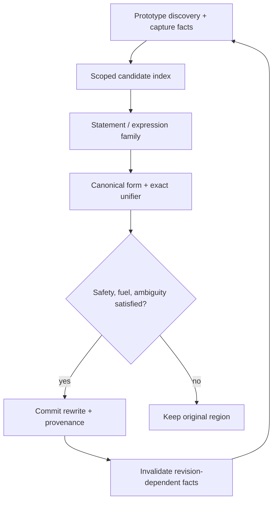

# Deinline Next: kiến trúc, bằng chứng và kế hoạch kiểm chứng

Mốc đánh giá: [`c8425be`](https://github.com/Kiet1308/Tovek/commit/c8425be254f5693da9f4f8796fa7dacb60aa76bd),
nhánh `main` được đọc ngày 2026-10-06 (UTC+7). Bản triển khai nằm trên
`feat/deinline-next`. Những con số đo phải được đọc cùng báo cáo kiểm chứng ở cuối
tài liệu; không suy tốc độ toàn pipeline từ một phép đếm thao tác.

## 1. Đánh giá kiến trúc hiện tại

Deinline hiện tại có nền tảng semantic tốt và đã vượt xa một bộ tìm mẫu đơn giản.
Statement pass nhận diện bản sao thân helper sau canonicalization, specialization,
guard/return lowering, result registers và continuation cloning. Expression pass
chạy ở các vị trí đã được chọn theo thứ tự cleanup để các cấu trúc cần khớp còn
tồn tại. Arithmetic family yêu cầu prototype có tên từ bytecode và giới hạn miền
biểu thức có thể chứng minh. Các pass chia sẻ exact unifier và capture analysis.

Các điểm cần giữ:

- **Exact structural proof.** Parameter bind một lần; local của callee đổi tên
  injective; global, upvalue, literal bit pattern, operator và arity phải phù hợp.
- **Safety theo cách thực thi Luau.** Không coi một tên local là bằng chứng rằng
  giá trị ổn định. Phân biệt register với upvalue, writer có thể escape, thứ tự đọc
  receiver, argument đầu tiên, multi-return và hàm quan sát call frames.
- **Lexical scope.** Helper chỉ hoạt động sau declaration, chỉ trong phạm vi nhìn
  thấy binding đó, và không thay chính thân definition bằng lời gọi đệ quy.
- **Ambiguity.** Statement pass xét hết các đối thủ có thể khớp; cùng vùng dài nhất
  mà nhiều helper phù hợp thì từ chối. Expression pass giữ quy tắc xếp hạng hoist.
- **Bounded work.** Giới hạn số target, kích thước shape, số iteration, số attempt
  arithmetic và fuel dùng chung. Hết fuel khi chưa xét xong đối thủ thì không commit.
- **Provenance trung thực.** Một lời gọi tương đương không phải bằng chứng rằng
  source nguyên gốc từng có lời gọi tại vị trí đó.

Các giới hạn kiến trúc quan sát được:

| Vấn đề | Hệ quả | Thay đổi trong nhánh này |
|---|---|---|
| `deinline.rs` gần 10.000 dòng, chứa discovery, normalization, proof, scheduling và test | Khó review một invariant mà không đi qua phần không liên quan | Tách module theo trách nhiệm, giữ nguyên API và các proof rule |
| Mỗi vị trí vẫn đi qua danh sách active targets để loại theo head kind/name | Chi phí discovery tăng theo số helper dù phần lớn không thể khớp | Compile các điều kiện loại hiện hữu thành index theo scope |
| Selection adapter của arithmetic chỉ được gọi tại selection root | Bỏ lỡ selection tương đương nằm dưới một operator khác | Áp dụng cùng proof recursively qua operator/operand chính xác |
| Đánh giá performance dễ bị lẫn build config, cache hoặc workload | Một con số speedup riêng lẻ không đủ để chấp nhận | Ablation feature, workload sinh tái lập, benchmark toàn pipeline xen kẽ |

Đây là nâng cấp ranh giới kiến trúc và lượng công việc. Không thay toàn AST bằng
arena hoặc chạy các AST pass song song: các hướng này đã được đo trong
[`performance/dead_ends.md`](performance/dead_ends.md) và chưa có bằng chứng mới để
lặp lại chúng.

## 2. Kiến trúc đích



Index chỉ trả một superset các candidate mà exact matcher có thể chấp nhận.
Normalization chỉ tạo dạng có thể so sánh; unifier chỉ chứng minh correspondence.
Driver sở hữu scope, canonical-window cache, liveness, search budget và việc sửa
AST. Các lớp này không được tự thay nhau cấp quyền rewrite.

Các module mới không tạo một bản AST khác hoặc giữ thêm ownership của closure/local.
Các entry point `deinline`, `expr_deinline`, `arithmetic_deinline_early` và vị trí của
chúng trong pipeline giữ hợp đồng cũ. Việc chuyển file phải giữ nguyên thân các
proof function và toàn bộ test cũ.

| Module | Trách nhiệm |
|---|---|
| [`deinline.rs`](../ast/src/deinline.rs) | Driver, lexical activation, ambiguity, fuel, site matching và commit rewrite |
| [`deinline/targets.rs`](../ast/src/deinline/targets.rs) | Discovery, eligibility và phân loại helper |
| [`deinline/candidates.rs`](../ast/src/deinline/candidates.rs) | Index theo head và duyệt rank đúng thứ tự |
| [`deinline/canonical.rs`](../ast/src/deinline/canonical.rs) | Canonical forms và phép tính độ dài không tạo bản sao |
| [`deinline/unify.rs`](../ast/src/deinline/unify.rs) | Bind-once parameter, injective local mapping và exact structural correspondence |
| [`deinline/tests.rs`](../ast/src/deinline/tests.rs) | Toàn bộ 61 regression statement-pass có sẵn, giữ nguyên thân test |

File driver giảm từ 9.984 xuống 5.122 dòng. Đây là thay đổi về khả năng review và
mở rộng, không phải mức giảm tương ứng của lượng code hay thời gian chạy: các
proof và test được chuyển sang module của chúng, không bị xóa.

## 3. Candidate index: nhanh hơn bằng cách bỏ đúng phần việc thừa

### 3.1 Điều kiện đủ để loại

Index được xây từ **đúng** các điều kiện mà `try_match_at` đã sử dụng trước khi
tiêu hao fuel:

1. Head kind của void helper hoặc value helper có prefix phải khớp kind tại site.
2. Nếu cả hai head có một fixed method/global-call name và khác nhau, loại.
3. Head `If` ở site vẫn có thể khớp `Assign` sau select fusion.
4. Value helper bắt đầu tại result declaration và helper có leading `If` có thể
   biến mất khi specialize thuộc wildcard bucket.
5. Site không có fixed name phải giữ **mọi** tên của target có head kind phù hợp.

`None` ở bước 5 không có nghĩa là tên không khớp. Hash collision chỉ được phép
tạo false positive; exact matcher sau đó quyết định. Index không đọc semantics từ
tên helper, không dựa vào source line để loại đối thủ và không thay đổi phép bind.

### 3.2 Biểu diễn và thứ tự

Mỗi danh sách đã ưu tiên có tối đa 256 rank. Một set rank dùng bốn `u64`; query
gộp các mask và duyệt bit từ thấp lên cao. Thứ tự candidate còn lại vì vậy giống
thứ tự cũ. Index chứa rank, discriminant và hash; không chứa `RcLocal`, closure
hoặc reference đến một node có thể bị thay.

Scope nhỏ dùng scan tuyến tính để tránh trả chi phí tạo hash maps. Scope lớn xây
index tại cùng điểm driver đã tính lại priority khi declaration làm active set
tăng. Vượt capacity của index phải trở về scan đầy đủ, không cắt bớt danh sách.
Giới hạn toàn module 256 target vẫn là một gate riêng của driver.

Danh sách focused và rival đều giữ index riêng; rival chỉ được hỏi khi đã có một
focused match, như trước. Self-match và tất cả gate cũ vẫn nằm trong exact attempt.
Vì chỉ bỏ những attempt vốn bị loại trước fuel, index không được làm thay đổi
fuel đã dùng, thứ tự canonical-window query hay kết quả khi chạm giới hạn tìm kiếm.

Feature `ast/reference-deinline-candidates` giữ scan exhaustive để đo ablation.
Feature này là công cụ developer, không phải một mode làm giảm kiểm tra correctness.

### 3.3 Cache và invalidation

| Dữ liệu | Lifetime | Khi nào hết hiệu lực |
|---|---|---|
| Candidate signatures | Một lần collect target trong iteration | Thu thập lại target |
| Scope index | Active list + priority của một block scan | Declaration kích hoạt target mới hoặc rời block |
| Canonical windows | Một vị trí tìm match | Chuyển vị trí; splice làm vị trí cũ không còn nghĩa |
| Last local occurrence | Block hiện hành, dựng lazy | Splice |
| Capture facts | Revision AST dùng để thu thập target | Iteration sau có rewrite |
| Search fuel | Toàn lần chạy pass | Kết thúc pass |

Không cache proof âm qua revision: một rewrite có thể mở ra match mới hoặc làm
một đối thủ trước đây không còn tương đương.

## 4. Mở rộng arithmetic selection có giới hạn

Luau có thể biểu diễn một lựa chọn dưới các dạng `if c then y else n`, guard có
polarity đảo, hoặc `c and y or n` khi nhánh `y` chắc chắn truthy. Adapter hiện có
chứng minh sự tương đương tại một selection root; các node `Binary`/`Unary` bọc
bên ngoài trước đây chuyển cả subtree sang exact unifier, nên không gọi adapter
cho selection con.

Thay đổi cho phép đi xuyên qua `Binary` và `Unary` **chỉ khi operator trùng khớp**,
rồi áp dụng cùng adapter cho từng child theo thứ tự cũ. Các leaf vẫn dùng unifier
chung. Ví dụ một selection đã được chứng minh dưới phép nhân hoặc unary negation
có thể được nhận diện mà không cần làm phẳng, đổi thứ tự hoặc phân phối biểu thức.

Các ràng buộc không được nới:

- `c and y or n` chỉ là selection khi `y` thuộc literal truthy được cho phép;
  `false`, `nil` hay một biểu thức có thể trả về falsy phải bị từ chối.
- Mọi operand và operator giữ nguyên thứ tự. Không dùng commutativity,
  associativity, floating-point identities hoặc type annotation để đoán purity.
- Pattern và candidate vẫn bị giới hạn 64 node; chỉ miền scalar hiện có được
  chấp nhận. Không thêm call, global, table, index, closure hoặc result pack.
- Argument hoisting, capture stability, first-read và ambiguity vẫn được kiểm tra
  bởi expression driver. Một structural match chưa đủ để tạo lời gọi.
- Negative controls phải kiểm tra operator bị đổi, operand bị đổi chỗ, parameter
  lặp không nhất quán, falsy selection và capture có thể biến đổi.

### Ca khôi phục thêm trong pipeline thực tế

Fixture [`deinline_nested_selection.luau`](../luau-lifter/tests/fixtures/deinline_nested_selection.luau)
giữ cả hai parameter còn sống sau selection để compiler không tái sử dụng parameter
register làm result register:

```luau
local function nestedCurve(value, bias)
    return -(((if value < 0 then bias else value * 3) + bias) + value)
end

print("nested-copy", -(((value < 0 and 2 or value * 3) + 2) + value))
```

Với `--style compact`, bản mới khôi phục site này thành
`print("nested-copy", nestedCurve(value, 2))`. Helper giữ `IfExpression` vì `bias`
chưa biết truthiness; site chuyên biệt hóa `bias` thành literal truthy `2` nên có
dạng `and/or`. Selection adapter mới nhận diện được correspondence bên dưới các
phép cộng và unary negation mà vẫn giữ nguyên thứ tự tính.

| Mức tối ưu input | Số call trong output compact của baseline | Số call của bản mới |
|---|---:|---:|
| O0 | 1 | 2 |
| O1 | 1 | 2 |
| O2 | 0 | 2 |

Không tính helper declaration trong số call. Cả hai style × hai implementation ×
ba mức tối ưu, tổng cộng 12 output, đều compile lại và khớp stdout/exit status của
source. Khả năng khôi phục thêm ở ca này thuộc style `compact`; default style giữ
selection chưa biết truthiness ở dạng statement. Regression Rust dùng bytecode O2
đã pin và kiểm tra đích danh cả hai site cùng số call, không chỉ kiểm tra marker.

Fixture rộng hơn trong `docs/failure_fixtures/semantic_roundtrip` kiểm tra numeric
edge cases, metamethod trace và các nhánh có thể ném lỗi. Output default của fixture
đó giống nhau giữa baseline và nhánh này; nó là kiểm chứng hành vi, còn fixture
compact ở trên mới là bằng chứng về khả năng khôi phục thêm.

## 5. Tiêu chí nghiệm thu

### Correctness và chất lượng output

1. Toàn bộ Rust test hiện có vẫn pass, cùng regression mới.
2. Index query được đối chiếu với predicate cũ độc lập trên nhiều head kind/name,
   wildcard, scope size và priority permutations; so cả candidate order.
3. Chạy branch mặc định và `reference-deinline-candidates` trên cùng input: source
   và metadata phải giống nhau, kể cả ambiguity và giới hạn fuel.
4. Các semantic round-trip compile ở `-O0/-O1/-O2`, decompile rồi compile/execute
   lại. Dùng pinned official Luau giống CI; chạy bytecode VM cho deep-review/fuzz.
5. Capability mới cần positive test thấy helper call được phục hồi và negative
   controls; không chấp nhận một round-trip pass chỉ vì không hề rewrite.
6. Kết quả ngoài corpus được ghi đúng phạm vi. Không coi synthetic stress hoặc
   một bộ fixture là toàn bộ dữ liệu Roblox thực tế của người dùng.

### Hiệu năng

Cả baseline và branch phải dùng cùng toolchain, release profile, linker flags và
cùng chế độ instrumentation. Timings chính chạy khi diagnostics tắt. Các lượt
baseline/branch xen kẽ để giảm drift; không tính clone, compile workload hay hash
validation vào thời gian thuật toán. Hash output và lỗi được kiểm tra ngoài vùng đo.

Hai lớp kết quả cần tách riêng:

- **Throughput decompiler:** wall time toàn pipeline, số output, output hashes,
  p50/p95 và RSS nếu host hỗ trợ. Dùng `scripts/benchmark_v2.py`; workload stress
  được sinh bằng `scripts/deinline_workloads.py`, cộng input có sẵn trong repo.
- **Code sinh ra:** semantic round-trip trên VM và compile ở optimization level
  phù hợp. Không tuyên bố mọi restored function call có cùng runtime cost ở `-O0`;
  compiler có thể inline lại ở `-O2`, còn function call vẫn có chi phí của nó.

Lợi ích index phụ thuộc độ rộng và độ chọn lọc của active helpers. Không được lấy
speedup của workload nhiều tên method khác nhau để hứa cùng hệ số cho tất cả scripts.
Nếu small/unselective scopes hồi quy, điều chỉnh hoặc bỏ index tại miền đó.

## 6. Những điều chưa thể suy ra từ bytecode

Luau công khai mô tả function inlining và loop unrolling ở `-O2`; khả năng debug
cũng thay đổi khi các tối ưu này chạy. Đó là lý do Tovek bảo vệ call-frame observers
và giữ cách diễn đạt “equivalent call inferred”. Ranh giới này là đặc tính của bài
toán khôi phục chương trình, không phải một vấn đề có thể giải quyết bằng tăng
ngưỡng heuristic.

Machine outlining của LLVM cũng tách discovery, eligibility và cost. Tuy nhiên
suffix tree của machine instruction không tự chứng minh được evaluation order,
metamethod, lexical capture hoặc multi-return trong Luau. Nhánh này dùng nguyên lý
tách trách nhiệm, không mang thuật toán đó vào AST khi chưa có workload chứng minh.

Nguồn đối chiếu:

- [Luau: performance, inlining, imports](https://luau.org/performance/)
- [Luau: standard library và debug.info](https://luau.org/library/)
- [LLVM MachineOutliner](https://llvm.org/doxygen/MachineOutliner_8cpp.html)
- [Các hướng performance đã thử của Tovek](performance/dead_ends.md)
- [Pipeline tích hợp](../luau-lifter/src/lib.rs)
- [Capture proof](../ast/src/deinline_safety.rs)

## 7. Kết quả kiểm chứng

### 7.1 Correctness

| Kiểm tra | Kết quả |
|---|---|
| Rust workspace và integration | 1.450 passed; 12 lỗi môi trường đã tái hiện cùng tên trên baseline; 2 test có sẵn được đánh dấu ignored |
| AST riêng trong workspace | 985 passed, 0 failed, 1 ignored; 3 integration khác passed |
| Feature `reference-deinline-candidates` | 117 passed, 0 failed; đây là lượt chạy riêng, có test trùng với workspace |
| Regression compact dùng bytecode đã pin | 2/2 passed; 12 biến thể output compile lại và chạy khớp source |
| Python tooling | 166/166 passed |
| Semantic compile/decompile/execute | 477/477 passed trên cả baseline và bản mới: 159 fixture × O0/O1/O2 |
| Deep-review với isolated VM | 289/289 passed |
| Typed fuzz: 80 seed × 3 profile, có mutation | 202 passed, 24 bytecode invalid, 14 refused, 0 mismatch |
| Output-size gate | 484 output, 0 regression |
| Bytecode round-trip gate | 159 fixture, 0 regression theo từng file và tổng; legacy `nonequiv` 174 → 174 |
| Residual control | Cả 7 output strict compile lại với official Luau |

Toàn bộ 477 source output default giống nhau từng byte giữa baseline và bản mới,
cũng như giữa bản mới và exhaustive-reference. Các lượt benchmark trên 80 input
synthetic và 477 fixture đều cho cùng output hash giữa ba bản và mọi round.

Lệnh workspace đầy đủ được chạy với `--no-fail-fast`: 1.447 test passed; hai
executable test sinh từ một lượt link trước đó bị ghi dở, chưa thể chạy. Sau khi
xóa đúng hai build artifact hỏng và build lại, 3 test của chúng đều passed, đưa
tổng lên 1.450. Không sửa source test hoặc gate để xử lý vấn đề này.

12 test cache/subprocess còn fail vì môi trường không có `/proc/self/exe`, vốn
được dùng để tìm và hash executable. Cùng 12 test fail trên commit gốc; danh sách
tên và nguyên nhân nằm trong evidence. Vì vậy **không ghi local workspace là
all-green**. CI trong repository tiếp tục chạy nguyên bộ workspace trên runner
bình thường, đồng thời thêm gate cho exhaustive-candidate feature.

Chỉ thêm các baseline entry của fixture mới sau khi đo: 3 entry output-size và
1 entry bytecode, kèm provenance. Mọi entry cũ và ngưỡng cũ giữ nguyên. Legacy
bytecode comparison có chuẩn hóa xóa register và có trường hợp chưa chứng minh
được dataflow; con số `nonequiv` là regression triage, không phải bằng chứng
semantic tương đương. Các VM/runtime checks ở trên là gate riêng.

### 7.2 Thời gian toàn pipeline

Ba executable dùng cùng Rust `nightly-2026-06-15`, release opt-level 3, fat LTO,
1 codegen unit, không incremental, không debug, cùng GNU ld và diagnostics tắt.
Luau pin ở `c2ec0d4e5ca50796ba174a7565298f59aa572268`, như CI. Mỗi ô có 15 round
đo, xen kẽ thứ tự chạy, sau warmup; không có build hoặc workload kiểm chứng khác
chạy đồng thời trong phiên đo.

Đơn vị dưới đây là **giây cho một sample**. Cột “CLI/sample” ghi số lần chạy trọn
CLI trong sample; không so trực tiếp một batch 8 lần với một sample chỉ chạy 1 lần.
`Reference` là cùng code nhánh mới với riêng candidate index bị tắt bằng feature.

| Corpus | Worker | CLI/sample | Baseline p50 | Next p50 | Reference p50 | Thay đổi thời gian Next/baseline |
|---|---:|---:|---:|---:|---:|---:|
| Synthetic, 80 input | 1 | 1 | 0,820966 | 0,659884 | 0,818302 | **−19,62%** |
| Synthetic, 80 input | 4 | 1 | 0,279960 | 0,218032 | 0,291110 | **−22,12%** |
| Semantic, 477 input | 1 | 1 | 0,499753 | 0,510020 | 0,532421 | +2,05% |
| Semantic, lượt đo ngắn ban đầu | 4 | 1 | 0,166156 | 0,187209 | 0,177084 | **+12,67%** |
| Small-scope control, 16 input | 1 | 16 | 0,671733 | 0,673492 | 0,704284 | +0,26% |
| Semantic, kiểm tra lại bằng sample dài | 4 | 8 | 1,316851 | 1,321587 | 1,312598 | +0,36% |

Lợi ích trên synthetic còn 19,36% khi so Next với Reference ở 1 worker; điều này
hỗ trợ việc quy phần lớn cải thiện cho candidate discovery. Các scope nhỏ và bộ
fixture không có một mức speedup tương ứng. Scope nhỏ có chênh lệch +0,26%; fixture
1 worker là +2,05%, nên không mô tả bản mới là nhanh hơn trong mọi trường hợp.

Lượt fixture 4 worker ngắn ban đầu có tín hiệu chậm hơn 12,67%. Harness quan sát
process mỗi 10 ms, trong khi mỗi sample chỉ khoảng 166–187 ms. Kiểm tra lại bằng
8 lần CLI liên tiếp trong một sample cho chênh lệch median +0,36%; batch p95 từ
1,472099 xuống 1,439652 s. Tín hiệu 12,67% không lặp lại ở lượt sample dài. Giữ cả
hai lượt trong evidence; không bỏ dữ liệu bất lợi hoặc sửa code theo tín hiệu đó.

P95 dùng nearest-rank, với 15 sample thì bằng sample lớn nhất. Synthetic 1 worker
có p95 0,971148 → 0,778348 s; 4 worker 0,322969 → 0,253067 s. P95 của các lượt
aggregate là percentile **của batch**, không phải tail latency mỗi lần gọi CLI.

### 7.3 Bộ nhớ và phạm vi kết luận

Peak RSS được đo riêng bằng `wait4().ru_maxrss`, 5 native process cho mỗi ô,
không dùng giá trị null của sampler `/proc` làm số 0. Control chạm thực vào một
allocation 64 MiB đã xác nhận phép đo có phản ánh tăng resident memory.

| Corpus | Worker | Baseline median RSS (MiB) | Next median RSS (MiB) |
|---|---:|---:|---:|
| Synthetic | 1 | 44,844 | 44,758 |
| Synthetic | 4 | 108,789 | 104,930 |
| Semantic fixtures | 1 | 37,145 | 37,211 |
| Semantic fixtures | 4 | 69,270 | 69,438 |

Không thấy tăng RSS đáng kể trên những corpus này; fixture chênh dưới +0,25%.
Đây là process RSS, không phải allocation count hoặc bằng chứng về retained heap.
“4 worker” chỉ là số worker yêu cầu, không khẳng định 4 physical core: CPU model,
topology và quota không quan sát được. Kết quả thuộc một Linux host, filesystem
cache ấm, GNU ld chung cho cả ba bản, và những input được ghi trong manifest.
Chưa đo private production corpus, cold cache hay API-only throughput. Không suy
ra cam kết performance cho mọi chương trình hoặc runtime cost của mọi call được
khôi phục.

### 7.4 Evidence và tái lập

[`performance/deinline_next/evidence.json`](performance/deinline_next/evidence.json)
chứa đủ 288 timing row (gồm warmup), 60 RSS row, 557 input manifest record, hash
source tree/executable/compiler, config build, kết quả semantic, cả lượt đo ban
đầu lẫn follow-up và giới hạn diễn giải. Không có số đo được suy đoán từ số node
hoặc số candidate.

Các lệnh build ba executable và pinned Luau nằm trong `reproduction.build_commands`
của evidence. Chọn các đường dẫn mới cho `BENCH_WORK`, `LUAU_SOURCE`, `LUAU_BUILD`,
build cả ba với cùng toolchain/profile/linker, rồi từ root của repository chạy:

```bash
export DEINLINE_ONE_CPU=2
export DEINLINE_MANY_CPUS=2,3,4,5
bash docs/performance/deinline_next/reproduce.sh \
  "$BENCH_WORK/results" \
  "$BENCH_WORK/bin/baseline" "$BENCH_WORK/bin/next" "$BENCH_WORK/bin/reference" \
  "$LUAU_BUILD/luau-compile" "$LUAU_BUILD/luau"
```

Thay CPU affinity bằng các ID được phép trên máy đo. Script từ chối thư mục work
đã tồn tại để không lẫn input cũ. Nó tạo 5 scenario × 16 replica có bytecode khác
nhau, chạy corpus semantic và cả hai phép đo aggregate bằng chính harness hiện có.
Helper [`measure_peak_rss.py`](performance/deinline_next/measure_peak_rss.py) cùng
control và command template trong evidence dùng cho lượt đo memory riêng.

Các lệnh regression chính:

```bash
cargo +nightly-2026-06-15 test --locked --workspace --all-targets --no-fail-fast
cargo +nightly-2026-06-15 test --locked -p ast --features reference-deinline-candidates deinline
cargo +nightly-2026-06-15 test --locked -p luau-lifter --test deinline_nested_selection
python3 -m unittest discover -s scripts -p 'test_*.py'
```

Fixture VM, typed fuzz, output-size và bytecode gates dùng nguyên lệnh đã pin
trong [CI workflow](../.github/workflows/ci.yaml). Khi cần chẩn đoán khác biệt giữa
baseline và branch, giữ nguyên input/compiler hashes và đối chiếu source output
trước khi diễn giải thời gian đo.
